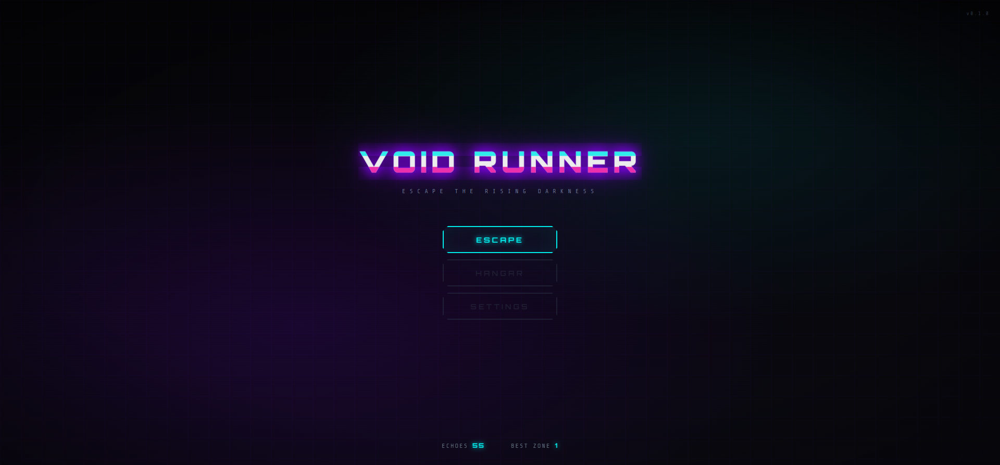
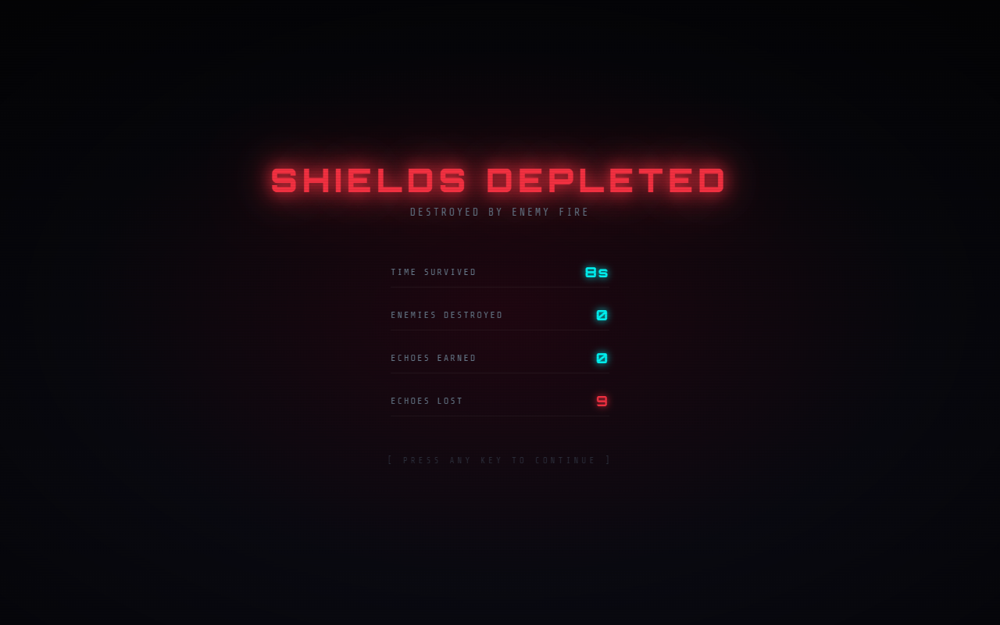

# Void Runner

A fast-paced 2D space shooter built with Three.js where players escape a rising death boundary called "The Void". The core mechanic punishes passive play and rewards aggressive risk-taking.

## Screenshots

### Main Menu


### Death Screen


## Gameplay Features

### The Void
- Rising purple boundary from screen bottom
- Rises faster when player hasn't killed enemies (CALM → RISING → HUNTING states)
- Touching the Void = instant death
- Pushed back by grazing bullets and killing enemies

### Combat
- Mouse position controls ship movement
- Left click holds to auto-fire
- Right click/Shift = dash with invincibility frames
- 3 shield hit points

### Graze System
- Bullets passing within 20px without hitting reward echoes
- Combo multiplier increases with consecutive grazes (x1 → x1.5 → x2 → x3)
- Getting hit resets combo

### Economy
- **Echoes**: Persistent currency earned from kills and grazes
- Echoes are banked between runs
- Death penalty: lose 60% of carried echoes

## Technology Stack

- **Rendering**: Three.js
- **Build**: Vite
- **State Management**: Plain JS classes
- **Persistence**: localStorage

## Getting Started

```bash
# Install dependencies
npm install

# Start development server
npm run dev

# Build for production
npm run build
```

## Controls

| Action | Input |
|--------|-------|
| Move | Mouse position |
| Fire | Left click (hold) |
| Dash | Right click / Shift |

## UI Features

- **Neon Void aesthetic** with CRT scanline overlay
- **Glitch effect** on title text
- **Corner frame decorations** on HUD elements
- **Dynamic void status indicator** (CALM/RISING/HUNTING)
- **Combo multiplier display**
- **Zone progress tracking**

## License

MIT
